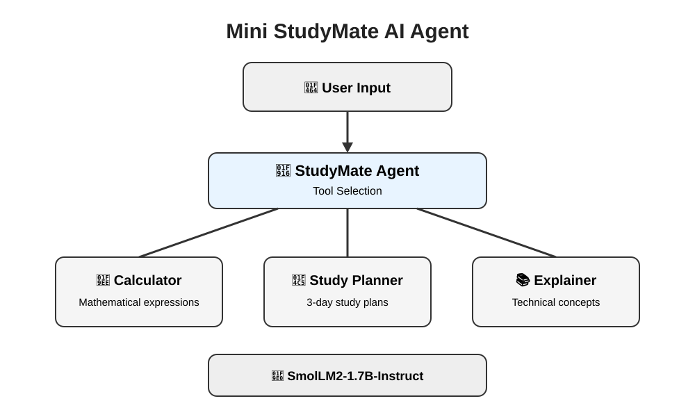

# 🤖 Mini StudyMate AI Agent

A beginner-friendly AI study assistant built with Python, Hugging Face Transformers, and the SmolLM2-1.7B-Instruct model.

## 📌 Project Overview

Mini StudyMate AI Agent is designed to help students with common study tasks through a simple interactive AI assistant.

The agent can:

- 🧮 Perform mathematical calculations
- 📚 Explain technical concepts in beginner-friendly language
- 📅 Create simple 3-day study plans

## ✨ Features

### 1. 🧮 Calculator

The calculator handles basic mathematical expressions such as:

```text
calculate 25 + 75
calculate 15 * 12
calculate 100 / 4
Example output:

Calculator Result: 100
2. 📚 Technical Concept Explainer

The AI can explain technical topics in a beginner-friendly way.

It provides:

Simple definition
Easy explanation
Real-world example
Small technical example

Example:

Explain recursion in programming
3. 📅 Study Planner

The Study Planner creates a simple 3-day study plan for a subject.

Example:

Create a study plan for Python

The plan includes:

Basic concepts
Important concepts
Practice
Revision
Practice questions
Mini test
🧠 System Architecture


The system works by receiving a user request and selecting the appropriate tool.

                    User Input
                        │
                        ▼
                ┌───────────────┐
                │ StudyMate     │
                │ Agent         │
                └───────┬───────┘
                        │
              ┌─────────┼─────────┐
              │         │         │
              ▼         ▼         ▼
        Calculator   Planner   Explainer
              │         │         │
              └─────────┼─────────┘
                        │
                        ▼
                 AI Model Response
🛠️ Technologies Used
Python
PyTorch
Hugging Face Transformers
HuggingFaceTB/SmolLM2-1.7B-Instruct
Accelerate
Google Colab
📂 Project Structure
Mini-StudyMate-AI-Agent/
│
├── .gitignore
├── README.md
├── requirements.txt
├── studymate_agent.py
├── Mini_StudyMate_AI_Agent_FINAL.ipynb
└── architecture.svg
⚙️ Installation

Clone the repository:

git clone https://github.com/iamthash/Mini-StudyMate-AI-Agent.git

Move into the project folder:

cd Mini-StudyMate-AI-Agent

Install the required dependencies:

pip install -r requirements.txt
▶️ Running the Application

Run the Python application:

python studymate_agent.py

The application will display:

==================================================
🤖 MINI STUDYMATE AI AGENT
==================================================

I can help you with:

🧮 Mathematical calculations
📚 Technical concept explanations
📅 Study planning

Type 'exit' to stop.

Enter a request and StudyMate will select the appropriate function.

To exit:

exit
💡 Example
Mathematical Calculation

User:

calculate 25 + 75

StudyMate:

Calculator Result: 100
Concept Explanation

User:

Explain polymorphism in Java

StudyMate generates a beginner-friendly explanation.

Study Planning

User:

Create a study plan for Python

StudyMate generates a simple 3-day study plan.

🚀 Future Improvements

Possible future improvements include:

🌐 Web-based user interface
🧠 Conversation memory
📝 Quiz generation
📊 Student progress tracking
📚 Subject-specific learning modes
🧮 Improved mathematical reasoning
💬 Multi-turn conversations
👨‍💻 Project

Mini StudyMate AI Agent

A practical AI learning project built with Python, Hugging Face Transformers, and an open-source language model.

⭐ If you find this project useful, consider giving the repository a star.
